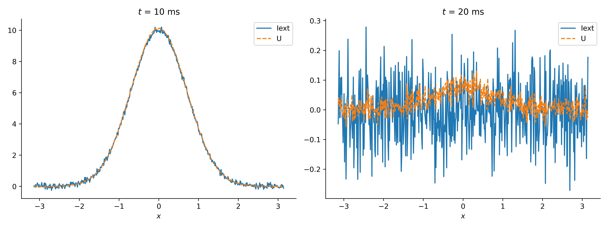
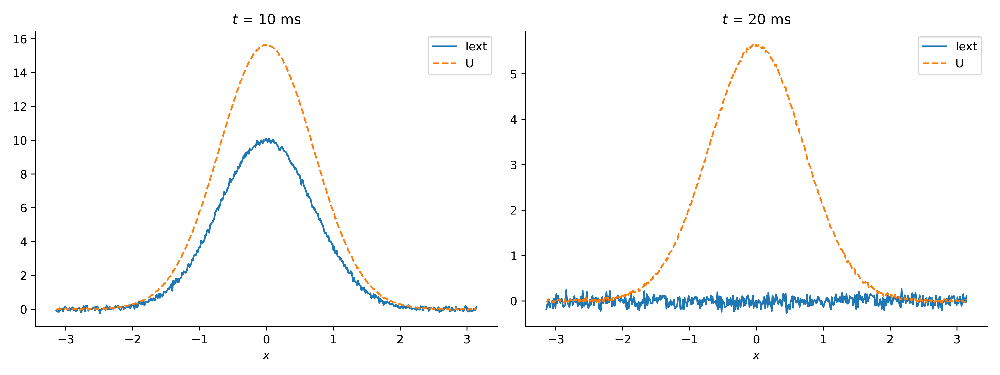
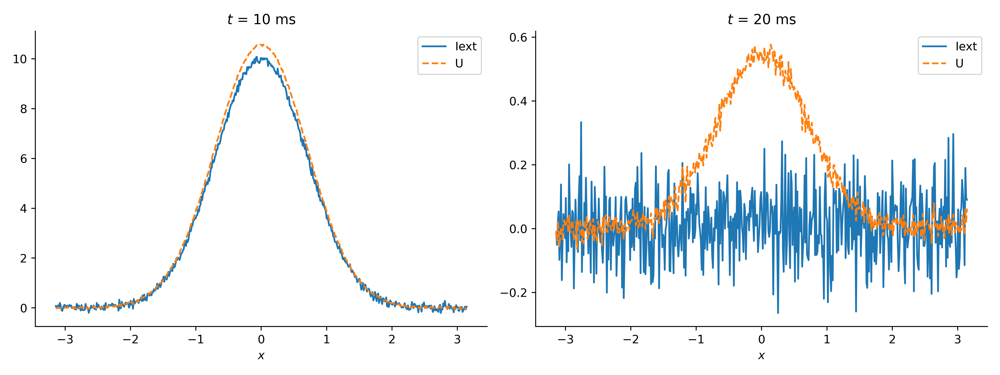
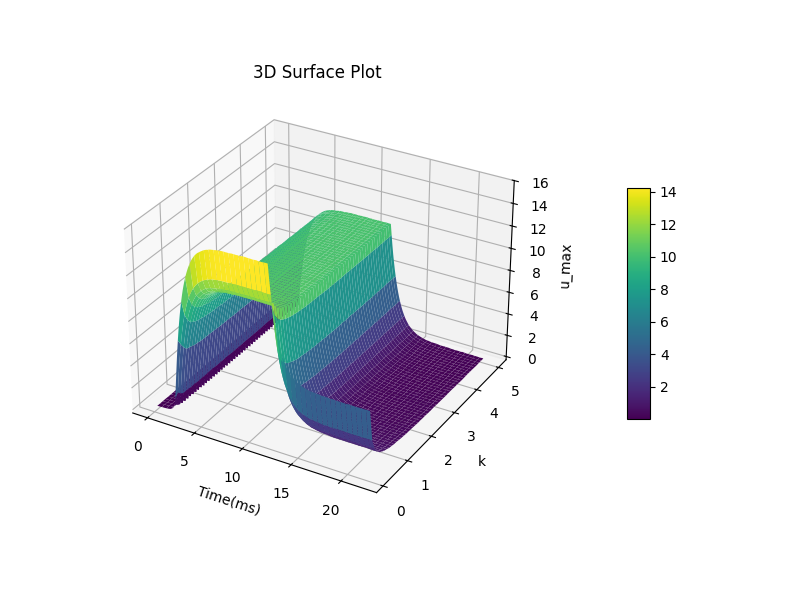
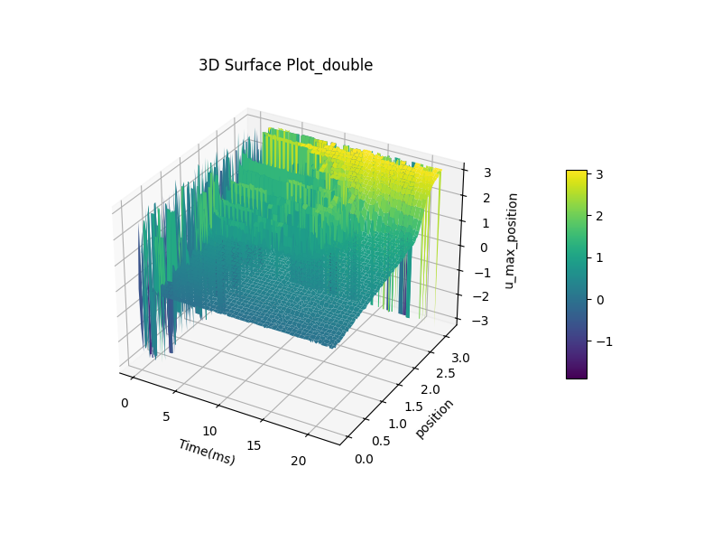
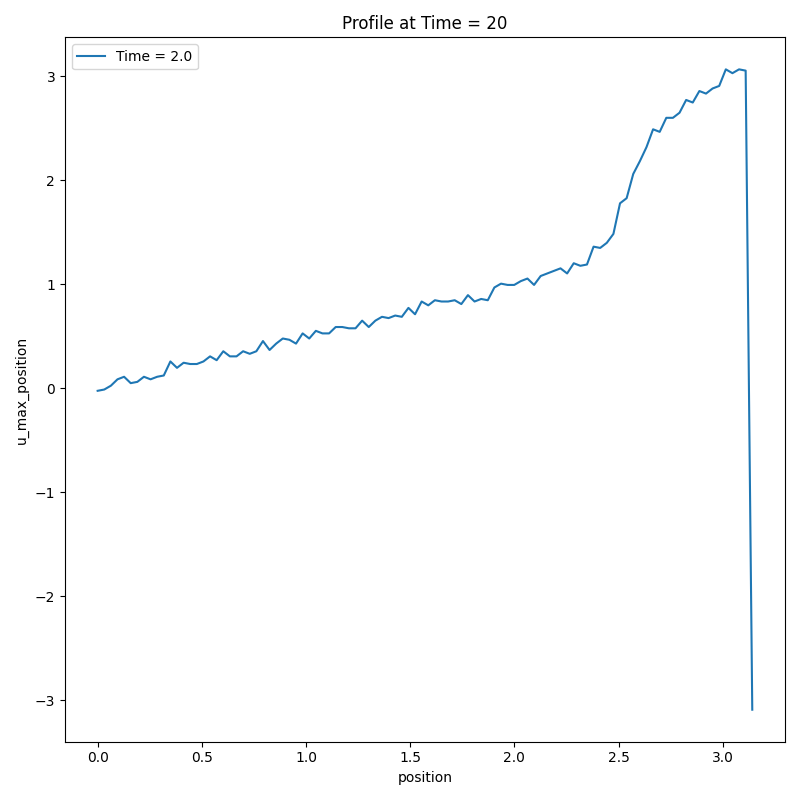
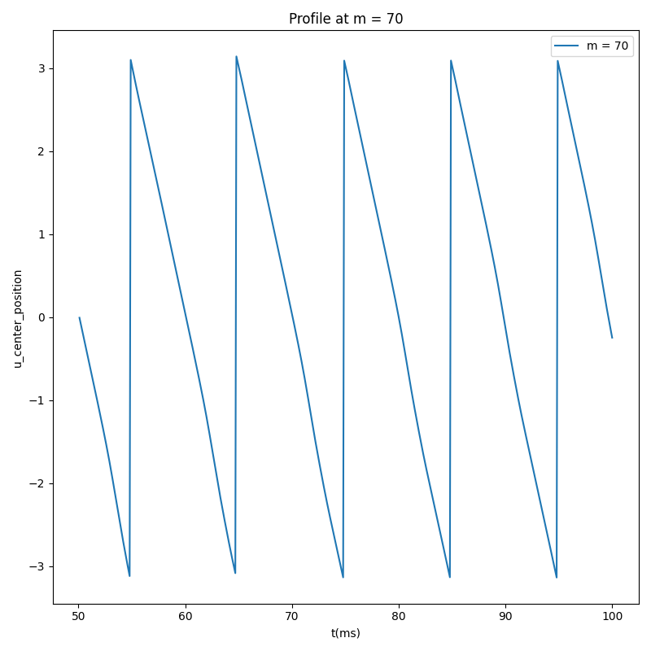
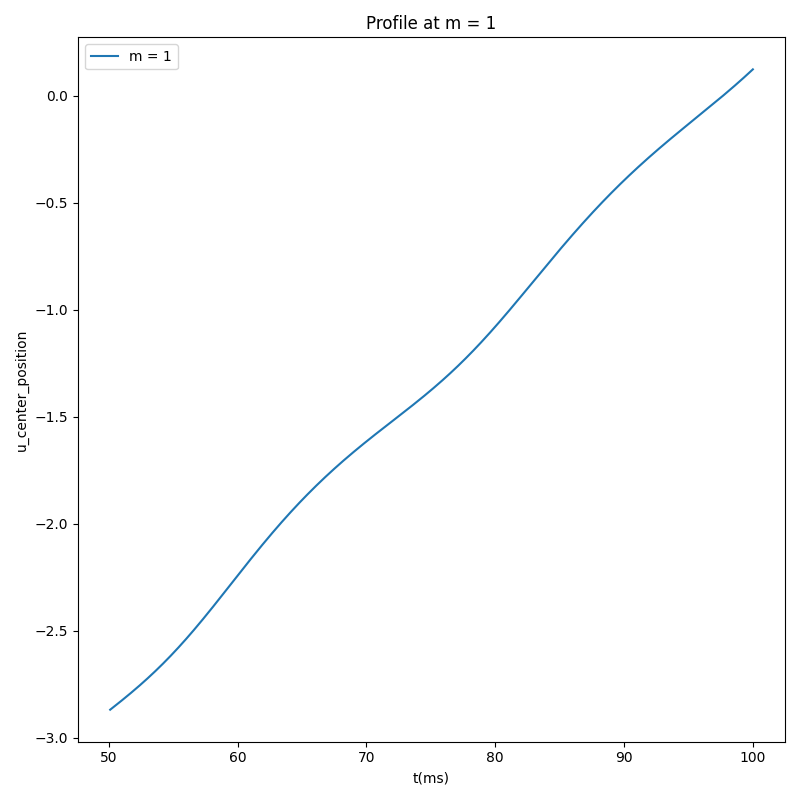
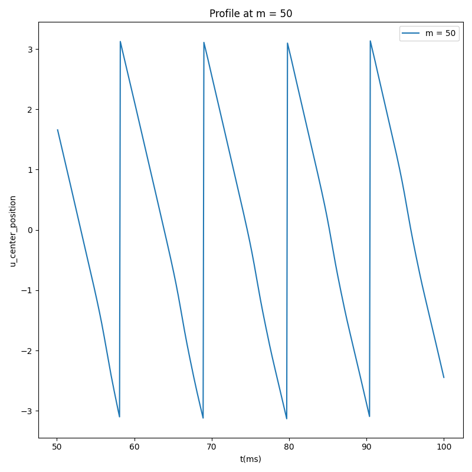
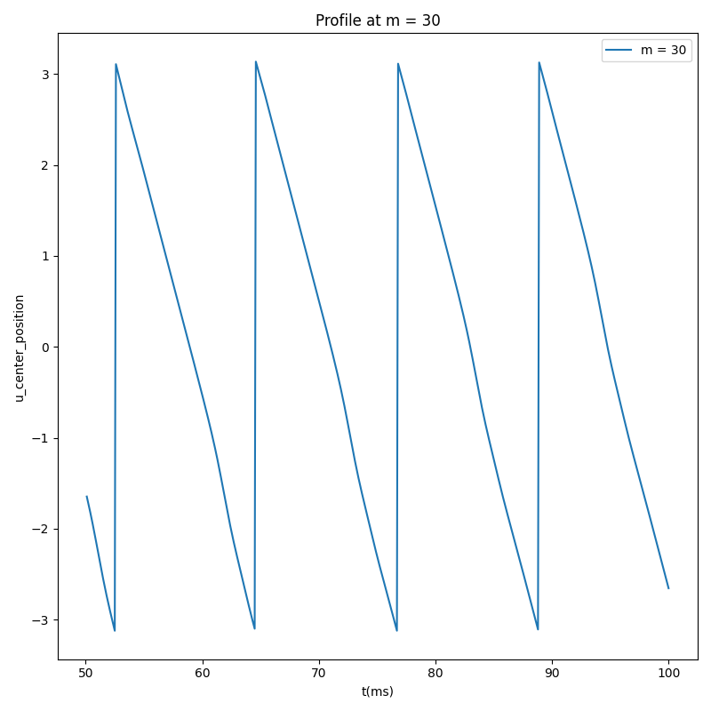

# 任务一：

## 实验一

**网络结构：**
神经元数量：512
时间步长：0.1 ms
外部输入：位置0处的高斯波包，峰值为10，携带噪音

**时序设计：**
前 2 ms：无外部输入。
中间 10 ms：给位置为 0 的神经元一个高斯波包输入
后 10 ms：撤除外部输入。

**分析目标：**
测试不同的 𝑘 值对网络持续活动的影响。

**实验结果：**

当 k 较小（如 𝑘=0.5）时，外部输入虽然可以激活网络，但是激活的网络幅度和输入一致，在移除输入后，网络状态迅速衰减，无法维持活动。

当 𝑘 较小时（如 𝑘=0.1）时，激活的网络幅度比输入要大，网络表现出强烈的自持活动，移除输入后，活动能持续较长时间甚至保持稳定。

中间值（如 𝑘=1.0）则表现出部分持续活动，持续时间随着 k 增大而减小。

为了更明确的探讨电压大小与k的关系，以时间和k值为自变量，神经网络激活电位的最大值为因变量，绘制3d图像,
其中，网络结构和时序设计与之前相同，时间步长为0.1ms，范围为0-22ms，k值步长为0.1，范围为0.1-5。
[3d电压响应图](interactive_3d_surface_plot.html)

由图可见，随着k的不断增加，相应电压不断降低，同时撤去外界输入后，电压下降的速率也随之提高。

**结论与讨论：**
持续活动机制：
当网络的 k 控制较高时，神经元的发放频率减弱，使得网络对于外界输入的增加更不敏感，在输入撤去后加快回到默认值。

**局限性：**
该实验仅考虑了高斯输入的简单情况，实际神经网络中的输入可能更加复杂。

## 实验二
**分析目标：**
测试输入不止一个波包时，网络持续活动的变化。

**网络结构：**
神经元数量：512
时间步长：0.1 ms
外部输入：多处位置的高斯波包，峰值为10，携带噪音
k = 0.1

**时序设计：**
前 2 ms：无外部输入。
中间 10 ms：给位置为 0 的神经元一个高斯波包输入
后 10 ms：撤除外部输入。

**实验结果：**
1. 当输入两个波包时(分别尝试pos=0,pi,pos=0,pi/3和pos=0,pi/1.5)
pos=0,pi

pos=0,pi/1.5

pos=0,pi/3

可以观察到，无论输入位置怎样变化，撤去刺激经过一定时间后网络的激活一定只剩余一个刺激，并且该刺激的激活强度与波包相邻位置无关。更进一步发现，波包相邻距离相对较大时，最终剩余的刺激是在初始刺激其中的某个位置，而相距较近时则是生成在两个初始位置中间。

为了探究这一现象，如实验一，继续制作3d图来观察外界输入的距离对最后刺激的影响
[3d电压响应图](interactive_3d_surface_plot_double.html)

如图所示，在大约20ms附近网络活动趋于稳定，因此截取20ms时的网络活动为例：

可以看到，在第二个刺激输入位置小于2.5时，最终网络激活的生成位置为第二个刺激输入位置的一半，这说明最终网络激活在两刺激间生成，而在第二个刺激位置大于2.5后，最终网络激活的生成位置与第二个刺激输入位置一样，说明网络激活在第二个位置处生成。
这个现象可以通过CANN网络的吸引子模型来解释。在CANN网络中，刺激（如波包输入）会影响神经元活动，网络最终会趋向于某种稳定的激活模式（吸引子）。不同输入刺激的位置会影响网络活动的最终稳定状态。
1. 当刺激输入位置较近时
当第二个刺激输入位置较小（即距离第一个刺激较近），两个刺激之间的距离较小。由于CANN网络的吸引子特性，网络的最终状态会尝试将这两个刺激整合为一个“吸引子”，即生成一个新的激活模式，位于两个刺激输入位置的中间。
2. 当刺激输入位置较大时
当第二个刺激输入位置较大（即距离第一个刺激较远），两个刺激的影响会分开。由于刺激之间的距离已经足够大，网络会趋向于保留更强的刺激激活，并将最终激活集中在第二个刺激的位置上。此时，第二个刺激的影响主导了网络的最终激活状态，因此，网络的激活位置接近第二个刺激的位置。

# 任务二

**网络结构：**
神经元数量：512
时间步长：0.1 ms
外部输入：位置0处的高斯波包，峰值为10，不携带噪音，移动速度为0.06
基于任务一的结论，为保持网络激活明显，令k=0.1

**时序设计：**
前 2 ms：给位置为 0 的神经元一个固定高斯波包输入
之后 1000 ms：高斯波包输入以0.06的速度向右移动。

**分析目标：**
测试不同的 m 值对网络持续活动的影响。

**实验结果：**
当m较大时，网络活动引发的电压以固定速率在神经环上移动，并且方向与输入方向相反。

当m较小时，网络活动引发的电压与输入刺激以相同的方向和速率运动。

这个现象可以通过CANN网络的吸引子模型的粗糙解来解释：
$$ 
\tau\frac{dU(x,t)}{dt} = -U(x,t) + I^{rec} (x,t) + I^{ext}(x,t) - V(x,t)\qquad(1) \\
$$
$$
\tau_v \frac{dV(x,t)}{dt} = -V(x,t)+ mU(x,t) \qquad (2)
$$
当m很小时，(2)式改写成
$$
\tau_v \frac{dV(x,t)}{dt} = -V(x,t)
$$
解为：
$$
V(x,t) = A(x) e^{-\frac{t}{\tau_v}}
$$
当时间足够久后，V趋于0，(1)式变为：
$$ 
\tau\frac{dU(x,t)}{dt} = -U(x,t) + I^{rec} (x,t) + I^{ext}(x,t)\\
$$
可以看出来，网络反应电压将和刺激输入同步；
当m很大时，类似的，(2)式改写为:
$$
\tau_v \frac{dV(x,t)}{dt} = mU(x,t) \qquad (2)
$$
(1)式两边同时求导，改写为：
$$
\tau \frac{d^2 U(x,t)}{dt^2} = -\frac{dU(x,t)}{dt} + \frac{dI^{rec}(x,t)}{dt} + \frac{dI^{ext}(x,t)}{dt} - mU(x,t)
$$
忽略掉除- mU(x,t)外其余项
$$
\tau \frac{d^2 U(x,t)}{dt^2} =  - mU(x,t)
$$
解得
$$
U(x,t) = A(x) \cos\left( \sqrt{\frac{m}{\tau}} t \right) + B(x) \sin\left( \sqrt{\frac{m}{\tau}} t \right)
$$
虽然该解十分粗糙，但可以看出随着m增大，U频率加快。分别对m=20，50，70时的网络活动加以检测：

可以明显的看出u移动速度的加快，也就是频率的减小。
综上所述，我们发现当k=0.1时，随着m的不断增加，网络响应不断从跟随刺激到自行移动，并且随着m的增加，响应电压的移动速度不断加快。